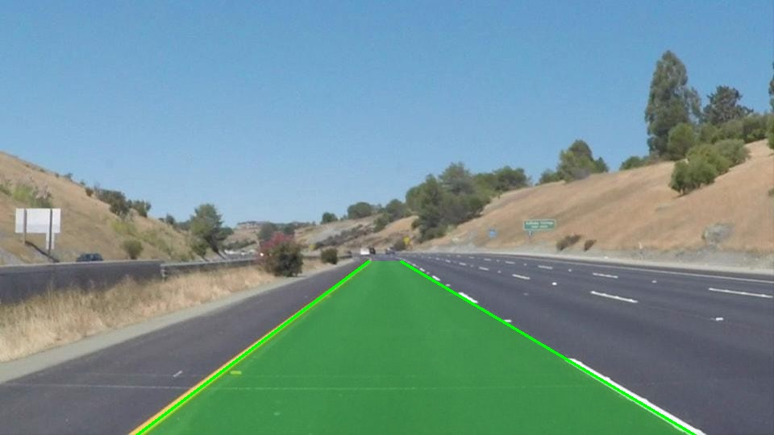

# Lane Detection System

A real-time lane detection system built with Python and OpenCV. 
The project implements a classic computer vision pipeline used in 
Advanced Driver Assistance Systems (ADAS) to detect and visualize 
lane boundaries from dashcam footage.

## Output

### Image


### Video
[](output_video.mp4)

## How it works

The pipeline processes each frame through these stages:

- Grayscale conversion and Gaussian blur to reduce noise
- Canny edge detection to find lane boundaries
- Trapezoidal region of interest mask to ignore sky and surroundings
- Hough Transform to detect line segments
- Line averaging and extrapolation into two clean lane lines
- Transparent green overlay drawn between the detected lanes

## Tech used

- Python
- OpenCV
- NumPy

## How to run

```bash
git clone https://github.com/shaikaltaaf123/lane-detection-adas
cd lane-detection-adas
python -m venv venv
venv\Scripts\activate
pip install -r requirements.txt
```

For image:
```bash
python lane_detection.py
```

For video — add your dashcam footage as `test_video.mp4` then:
```bash
python lane_detection_video.py
```

## Project structure
lane-detection-adas/
├── lane_detection.py        # Run this for image detection
├── lane_detection_video.py  # Run this for video detection
├── test_image.jpg
├── output_image.jpg
├── output_video.mp4
└── requirements.txt


## Using your own footage
There are two separate files — one for images and one for video.
If you want to test on your own dashcam footage, replace 
`test_image.jpg` or `test_video.mp4` with your own file.

Since every camera and road is different, you may need to adjust 
the trapezoidal region of interest to fit your footage. 
In both files, find this section and tune the values:

```python
trapezoid = np.array([[
    (int(width * 0.0),  height),              # bottom-left
    (int(width * 1.0),  height),              # bottom-right
    (int(width * 0.7),  int(height * 0.65)),  # top-right
    (int(width * 0.25), int(height * 0.65))   # top-left
]], dtype=np.int32)
```

Increase or decrease the decimal values (0.0 to 1.0) to move 
each corner of the trapezoid until it covers your lane lines.

## Limitations

Works best on straight roads with clear lane markings. 
Curved roads and low light are known weak points. 
Polynomial fitting for curves and TuSimple dataset 
testing are planned as next steps.

